# CSE328 Term Project - Motor Vibration Monitoring

## Project Summary

ESP32-based IoT system for real-time motor vibration monitoring, fault detection, and remote control.
The project reads vibration data from an ADXL345 accelerometer and surface temperature from an MLX90614 IR thermometer.
An Edge Impulse TinyML model runs on the ESP32 to classify motor behavior as `STOP`, `NORMAL`, or `WARNING`.
Anomaly detection is used to catch unseen mechanical imbalance patterns and latch the system into `FAULT`.
The OLED shows live state, confidence, anomaly, temperature, Wi-Fi, RSSI, cloud status, and IP information.
Arduino IoT Cloud receives live telemetry and provides dashboard controls for motor ON/OFF and fault reset.
A 5V relay cuts motor power when a fault is detected.

GitHub repository: https://github.com/aftekeli/CSE328-Term-Project

## Repository Contents

```text
firmware/
  MotorVibrationMonitoring.ino      Final ESP32 sketch
  thingProperties.h                 Arduino IoT Cloud variables and connection handler
  arduino_secrets.h                 Empty credential placeholders
model/
  ei-motor-vibration-monitoring-arduino-1_0_3.zip
data/
  STOP/                             70 CSV recordings
  NORMAL/                           70 CSV recordings
  WARNING/                          70 CSV recordings
docs/
  proposal.pdf
  system_architecture.drawio
  system_architecture.png
images/
  wiring_diagram.png
  hardware_setup.jpg
  dashboard.png
  oled_page_a.jpg
  oled_page_b.jpg
  oled_fault.jpg
  ei_*.png
```

## Components

| Component | Type | Purpose |
|---|---:|---|
| ESP32 Dev Board | Microcontroller | Runs sensor acquisition, TinyML inference, state machine, cloud sync, and actuator control |
| ADXL345 | 3-axis accelerometer | Primary vibration sensor for TinyML input |
| MLX90614 / GY-906 | IR thermometer | Secondary sensor for motor surface temperature and overheat fault detection |
| SSD1306 128x64 OLED | Display | Shows live state, confidence, anomaly, temperature, motor status, Wi-Fi/RSSI, cloud status, and IP |
| 5V relay module | Actuator | Switches motor power and cuts power in FAULT state |
| DC motor + propeller | Mechanical target | Simulates normal and abnormal vibration behavior |
| RGB LED | Status output | Green / blue / magenta / red / white state indication |

## System Architecture

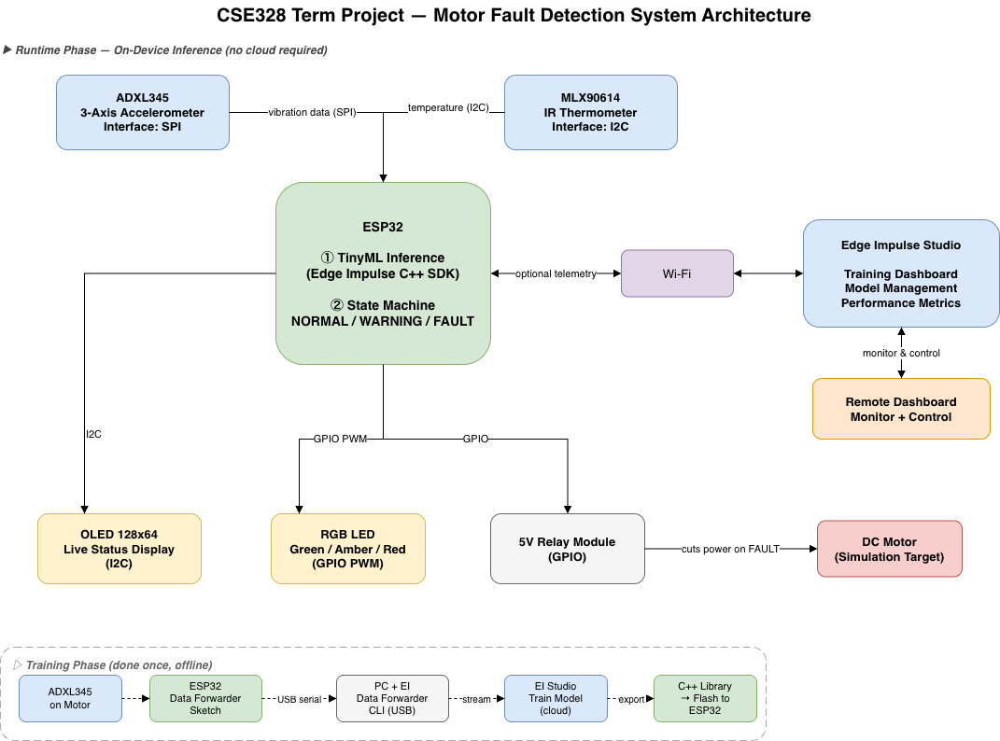

The system has two phases. During training, vibration CSV files are collected from the ESP32 and uploaded to Edge Impulse to train the model. During runtime, the ESP32 samples the ADXL345 at 50 Hz, builds a 2-second feature window, runs the exported Edge Impulse model locally, publishes telemetry to Arduino IoT Cloud, and controls the motor through the relay.

## Wiring

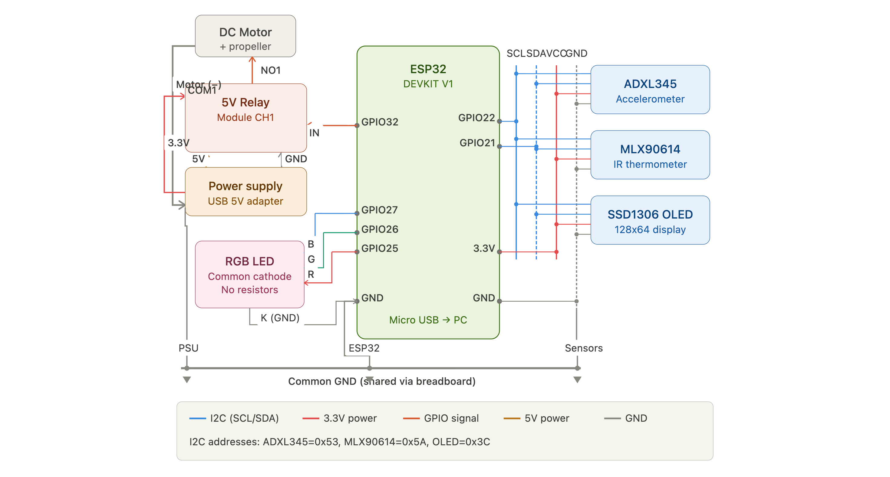

| Module | Module Pin | ESP32 / Connection | Notes |
|---|---|---|---|
| ADXL345 | VCC | 3V3 | Accelerometer supply |
| ADXL345 | GND | GND | Common logic ground |
| ADXL345 | SDA | GPIO21 | Shared I2C data line |
| ADXL345 | SCL | GPIO22 | Shared I2C clock line |
| ADXL345 | CS / SDO | Module-dependent | Final setup was verified with the working I2C module wiring |
| MLX90614 | VCC | 3V3 | IR thermometer supply |
| MLX90614 | GND | GND | Common logic ground |
| MLX90614 | SDA | GPIO21 | Shared I2C data line |
| MLX90614 | SCL | GPIO22 | Shared I2C clock line |
| OLED SSD1306 | VCC | 3V3 | 128x64 I2C OLED |
| OLED SSD1306 | GND | GND | Common logic ground |
| OLED SSD1306 | SDA | GPIO21 | Shared I2C data line |
| OLED SSD1306 | SCL | GPIO22 | Shared I2C clock line |
| Relay module | IN | GPIO32 | Active-low relay control in firmware |
| Relay module | VCC | 5V | Relay module supply |
| Relay module | GND | GND | Logic-side ground |
| Relay contact | COM / NO | Motor power path | Relay cuts motor power when FAULT is latched |
| RGB LED | R | GPIO25 through resistor | FAULT red channel |
| RGB LED | G | GPIO26 through resistor | STOP green channel |
| RGB LED | B | GPIO27 through resistor | NORMAL blue channel |
| RGB LED | Common | GND | Common-cathode configuration |

Firmware pin definitions are in `firmware/MotorVibrationMonitoring.ino`:

```cpp
#define SDA_PIN 21
#define SCL_PIN 22
#define RELAY_PIN 32
#define LED_R 25
#define LED_G 26
#define LED_B 27
```

## Cloud Setup

Platform: Arduino IoT Cloud.

The Cloud Thing exposes telemetry variables for dashboard monitoring and command variables for dashboard control.

| Variable | Direction | Update | Purpose |
|---|---|---|---|
| `systemState` | READ | On change | Text state: `STOP`, `NORMAL`, `WARNING`, `FAULT`, `SENSOR_ERROR` |
| `systemStateCode` | READ | On change | Numeric state for charts: `0..4` |
| `faultReasonCloud` | READ | On change | Fault source: `NONE`, `VIB`, `TEMP`, `SENS`, `EI` |
| `motorRunning` | READ | On change | Actual relay/motor state |
| `faultLatchedCloud` | READ | On change | Whether a fault is latched |
| `objectTempCloud` | READ | 1 second | MLX90614 object temperature |
| `anomalyCloud` | READ | 1 second | Edge Impulse anomaly score |
| `confidenceCloud` | READ | 1 second | Model confidence percentage |
| `motorCommand` | READWRITE | On change | Dashboard motor ON/OFF command |
| `resetFaultCommand` | READWRITE | On change | Dashboard fault reset command |

Dashboard widgets used:

| Widget | Variable |
|---|---|
| Switch | `motorCommand` |
| Push button / switch | `resetFaultCommand` |
| Status / text | `systemState`, `faultReasonCloud` |
| Value cards | `objectTempCloud`, `anomalyCloud`, `confidenceCloud` |
| Chart | `systemStateCode`, `anomalyCloud`, `objectTempCloud` |
| Indicator | `motorRunning`, `faultLatchedCloud` |

Dashboard evidence:

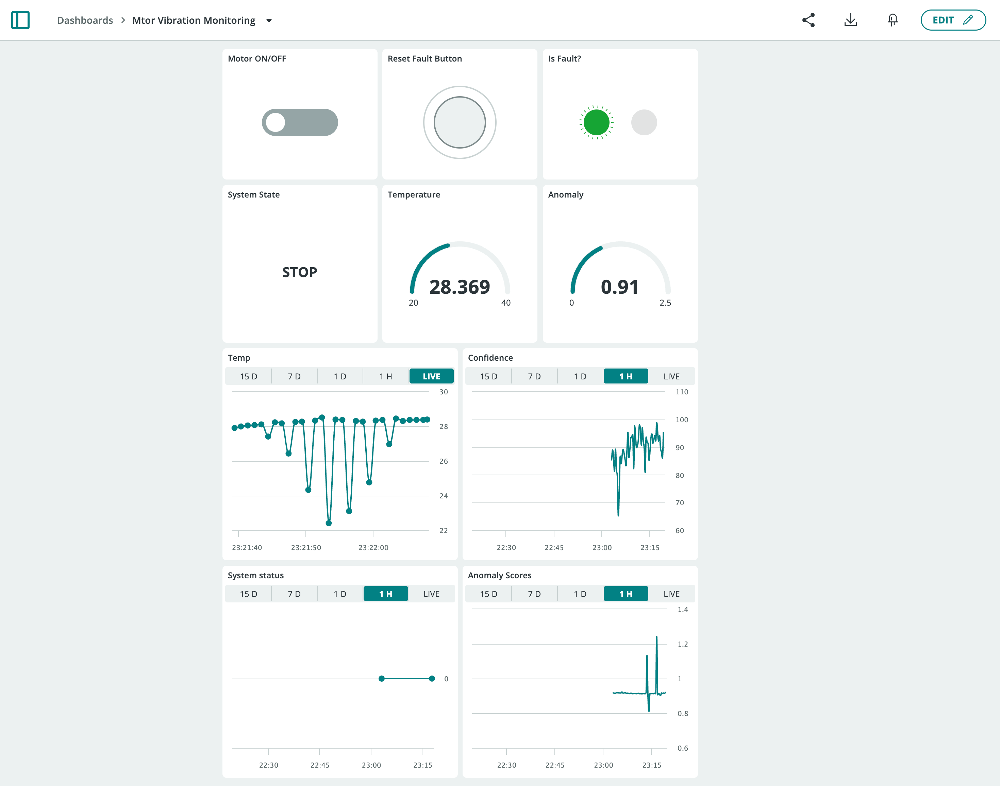

## Edge Impulse Model

The model is exported as an Arduino library and stored in:

```text
model/ei-motor-vibration-monitoring-arduino-1_0_3.zip
```

Training data is stored as balanced time-series CSV recordings:

| Class | File Count | Meaning |
|---|---:|---|
| `STOP` | 70 | Motor off / low vibration baseline |
| `NORMAL` | 70 | Motor running in normal condition |
| `WARNING` | 70 | Higher vibration condition |

Impulse configuration:

| Parameter | Value |
|---|---:|
| Sampling frequency | 50 Hz |
| Window size | 2000 ms |
| Window increase | 200 ms |
| Axes | `accX`, `accY`, `accZ` |
| Processing block | Spectral Analysis |
| Learning block | Classification |
| Anomaly block | GMM anomaly detection |

Model screenshots:

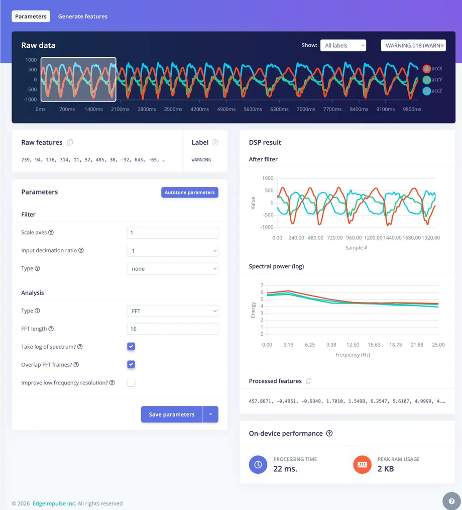

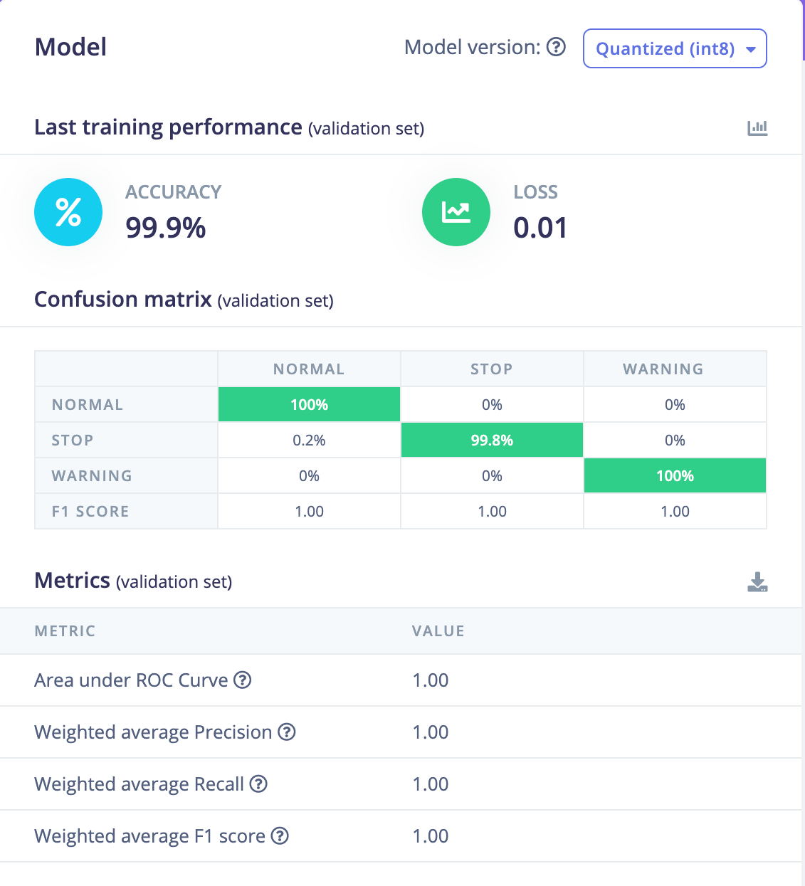

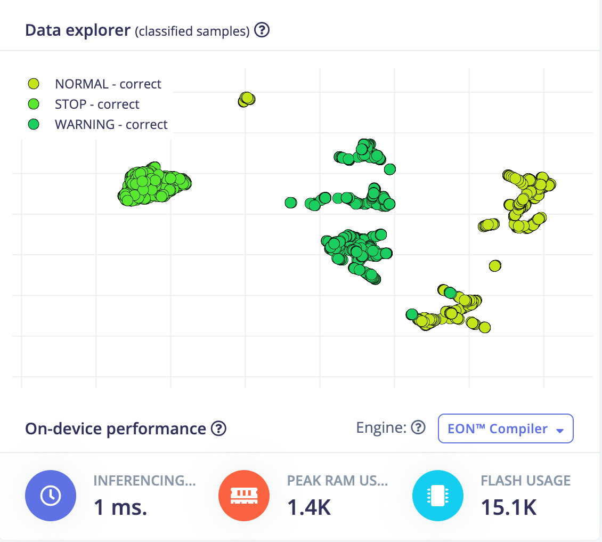

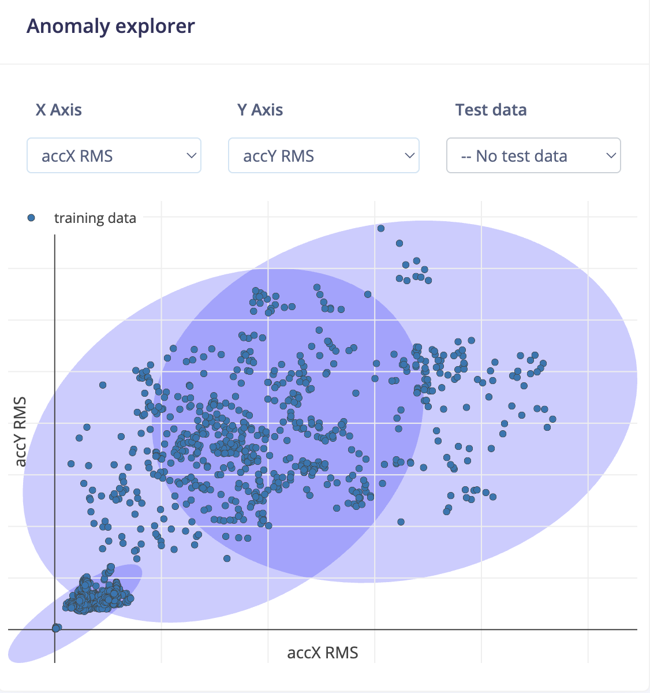

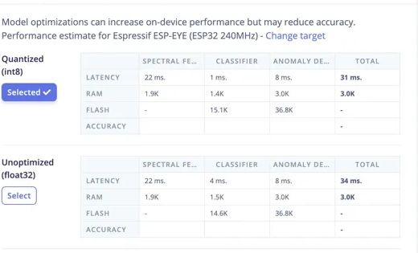

## Firmware Behavior

The ESP32 firmware runs a non-blocking loop:

1. `ArduinoCloud.update()` keeps dashboard communication active.
2. Serial commands are handled locally: `1` starts the motor, `0` stops it, `r` resets a latched fault.
3. MLX90614 temperature is read every second and published to Arduino IoT Cloud.
4. ADXL345 acceleration is sampled every 20 ms, which gives 50 Hz sampling.
5. A 2-second feature buffer is passed to the Edge Impulse classifier.
6. The state machine stabilizes transitions with two consecutive confirmations.
7. The relay cuts motor power when vibration, temperature, sensor, or inference fault is detected.

State behavior:

| State | Trigger | OLED | RGB LED | Relay |
|---|---|---|---|---|
| `STOP` | Motor off or STOP classification | STOP, confidence, anomaly, temperature, network page | Green | OFF |
| `NORMAL` | Normal model output | NORMAL live status | Blue | ON |
| `WARNING` | Warning model output below fault threshold | WARNING live status | Magenta | ON |
| `FAULT` | Anomaly above threshold twice, overtemperature, sensor fault, or inference error | Full-screen motor stopped warning | Red | OFF |
| `SENSOR_ERROR` | Repeated I2C failures | Sensor error warning | White | OFF |

Fault safety rules:

| Rule | Implementation |
|---|---|
| Motor cannot start while a fault is latched | `motorStart()` forces relay OFF and clears `motorCommand` |
| Motor OFF ignores model output | State remains `STOP` unless fault is latched |
| Startup transient is ignored | 3-second grace period after motor start |
| Vibration fault requires confirmation | Anomaly must exceed threshold for 2 consecutive inferences |
| Relay is fail-safe on fault | `latchFault()` immediately calls `setRelayRaw(false)` |

Final firmware thresholds:

| Constant | Value |
|---|---:|
| `OBJECT_TEMP_FAULT_C` | `32.0 C` |
| `ANOMALY_THRESHOLD` | `2.5` |
| `MOTOR_FAULT_GRACE_MS` | `3000 ms` |
| `STATE_CONFIRM_COUNT` | `2` |
| `VIB_FAULT_CONFIRM_COUNT` | `2` |

## OLED Display

The OLED is not a title screen; it shows live operating data. In normal operation, it alternates between Page A and Page B every 3 seconds.

Page A:

| OLED Item | Meaning |
|---|---|
| State | Large state label: `STOP`, `NORMAL`, or `WARNING` |
| Temperature + anomaly | MLX90614 object temperature and Edge Impulse anomaly score |
| Confidence + motor | Classification confidence and relay/motor state |
| Wi-Fi + cloud + RSSI | Wi-Fi status, Arduino Cloud status, and signal strength |

Page B:

| OLED Item | Meaning |
|---|---|
| State | Large state label: `STOP`, `NORMAL`, or `WARNING` |
| Temperature + anomaly | MLX90614 object temperature and Edge Impulse anomaly score |
| Confidence + motor | Classification confidence and relay/motor state |
| IP address | Full local IP address for network verification |

Evidence:

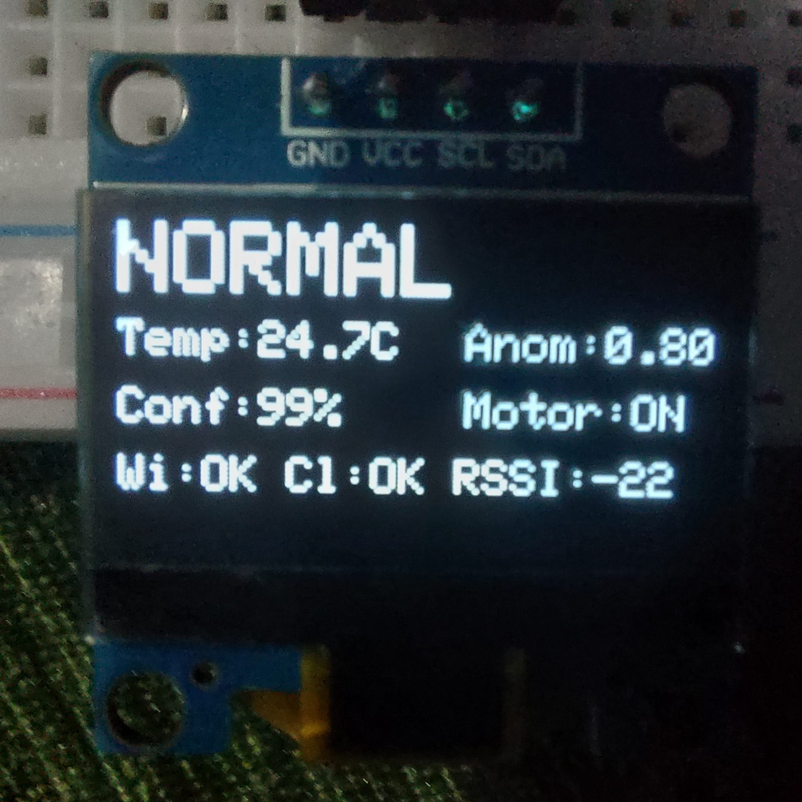

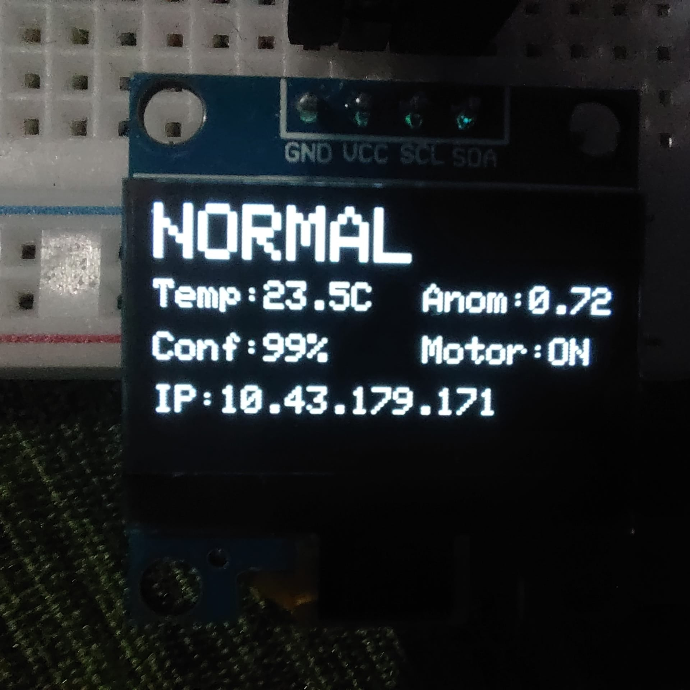

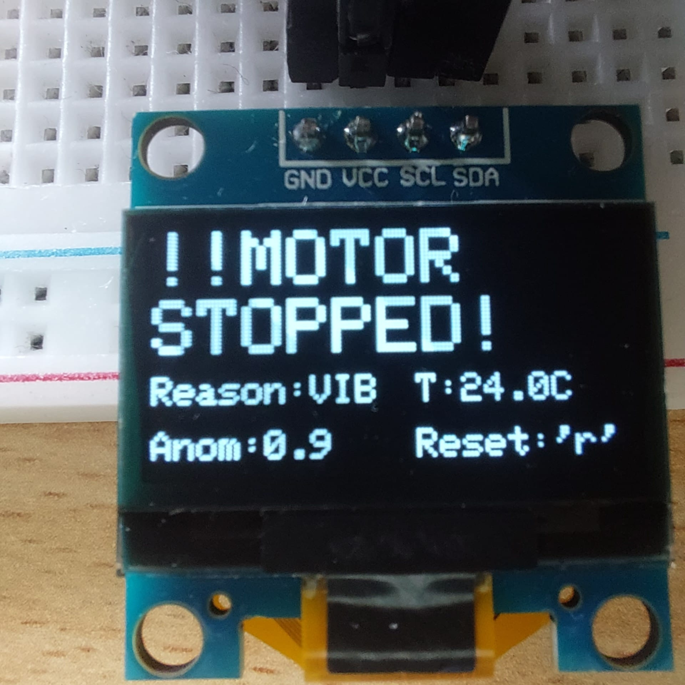

## How To Run

1. Install Arduino IDE.
2. Install ESP32 board support through Arduino Boards Manager.
3. Install required Arduino libraries:

```text
ArduinoIoTCloud
Arduino_ConnectionHandler
Adafruit SSD1306
Adafruit GFX Library
Adafruit MLX90614 Library
Wire
WiFi
```

4. Install the Edge Impulse Arduino library from:

```text
model/ei-motor-vibration-monitoring-arduino-1_0_3.zip
```

5. Open:

```text
firmware/MotorVibrationMonitoring.ino
```

6. Configure Arduino IoT Cloud credentials in `firmware/arduino_secrets.h`.

The repository keeps this file with empty placeholders:

```cpp
#define SECRET_DEVICE_KEY ""
#define SECRET_OPTIONAL_PASS ""
#define SECRET_SSID ""
```

7. Select an ESP32 board in Arduino IDE and upload the sketch.
8. Open Arduino IoT Cloud dashboard.
9. Use `motorCommand` to start/stop the motor and `resetFaultCommand` to clear a latched fault.

Local serial commands are also available at `9600` baud:

| Command | Action |
|---|---|
| `1` | Start motor |
| `0` | Stop motor |
| `r` / `R` | Reset latched fault |

## Evidence

Hardware setup:

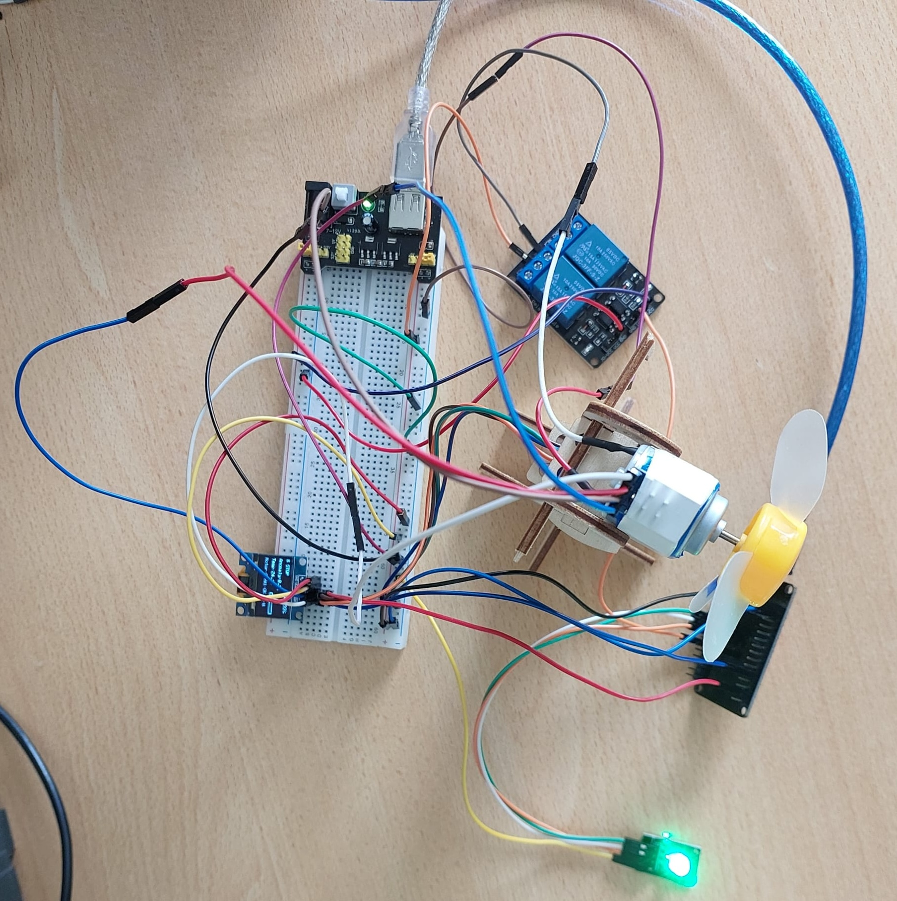

Dashboard:


OLED states:


System architecture:


Wiring diagram:


Demo note: the system is prepared for the oral presentation and live demonstration. The repository includes dashboard screenshots and hardware/OLED evidence images; the physical demo is performed with the ESP32, sensors, relay, motor, OLED, and Arduino IoT Cloud dashboard.

## Results

The final system satisfies the project requirements:

| Requirement | Status |
|---|---|
| ESP32 microcontroller | Implemented |
| At least 2 sensors | ADXL345 + MLX90614 |
| OLED with meaningful live information | State, confidence, anomaly, temperature, motor status, RSSI, Wi-Fi, cloud, IP |
| Additional actuator/output not OLED or LED | 5V relay controls motor power |
| Wi-Fi networking | Arduino IoT Cloud connection handler |
| Cloud publishing | Temperature, anomaly, confidence, state, fault reason, motor state |
| Cloud dashboard monitoring | Dashboard screenshot included |
| Cloud dashboard control | `motorCommand` and `resetFaultCommand` |
| Wiring table + diagram | Included |
| Evidence | Dashboard, hardware, OLED, Edge Impulse screenshots |

## Known Practical Notes

- The relay module is configured as active-low in firmware.
- The motor power path should be routed through the relay contact side; the ESP32 must not power the motor directly.
- The Edge Impulse library ZIP must be installed in Arduino IDE before compiling.
- `arduino_secrets.h` is intentionally committed with empty values; real Wi-Fi and device credentials should be filled locally before uploading.
